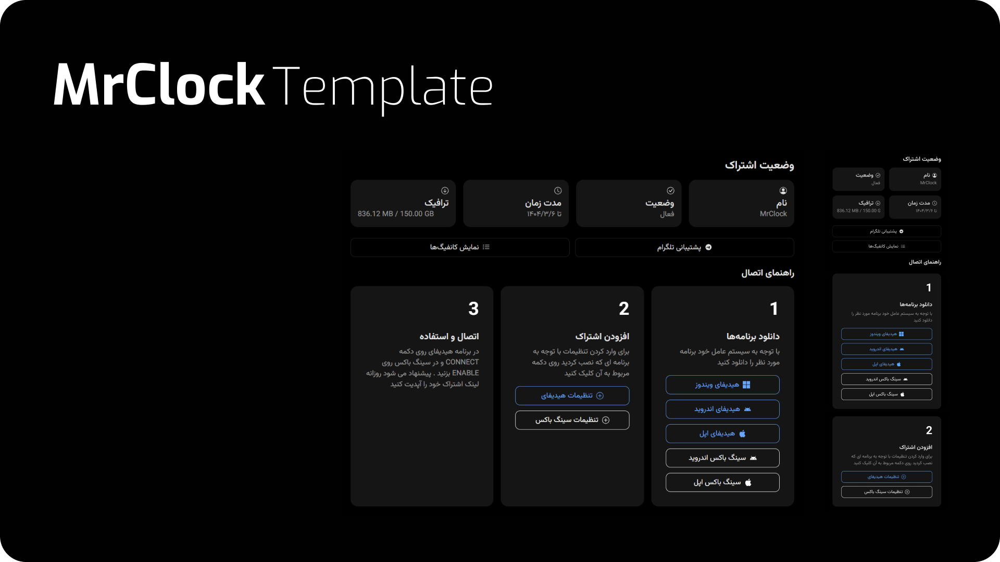

## Marzneshin

1. **Download the template:**
   ```sh
   sudo wget -N -P /var/lib/marzneshin/templates/subscription/ https://raw.githubusercontent.com/erfjab/ClockSub/refs/heads/main/marzneshin/index.html
   ```

2. **Run these commands:**
   ```sh
   echo 'CUSTOM_TEMPLATES_DIRECTORY="/var/lib/marzneshin/templates/"' | sudo tee -a /etc/opt/marzneshin/.env
   echo 'SUBSCRIPTION_PAGE_TEMPLATE="subscription/index.html"' | sudo tee -a /etc/opt/marzneshin/.env
   ```
   Or uncomment these lines in `/etc/opt/marzneshin/.env`:
   ```
   CUSTOM_TEMPLATES_DIRECTORY="/var/lib/marzneshin/templates/"
   SUBSCRIPTION_PAGE_TEMPLATE="subscription/index.html"
   ```

3. **Restart Marzneshin:**
   ```sh
   marzneshin restart
   ```

---

## Marzban

1. **Download the template:**
   ```sh
   sudo wget -N -P /var/lib/marzban/templates/subscription/ https://raw.githubusercontent.com/erfjab/ClockSub/refs/heads/main/marzban/index.html
   ```

2. **Run these commands:**
   ```sh
   echo 'CUSTOM_TEMPLATES_DIRECTORY="/var/lib/marzban/templates/"' | sudo tee -a /opt/marzban/.env
   echo 'SUBSCRIPTION_PAGE_TEMPLATE="subscription/index.html"' | sudo tee -a /opt/marzban/.env
   ```
   Or uncomment these lines in `/opt/marzban/.env`:
   ```
   CUSTOM_TEMPLATES_DIRECTORY="/var/lib/marzban/templates/"
   SUBSCRIPTION_PAGE_TEMPLATE="subscription/index.html"
   ```

3. **Restart Marzban:**
   ```sh
   marzban restart
   ```
